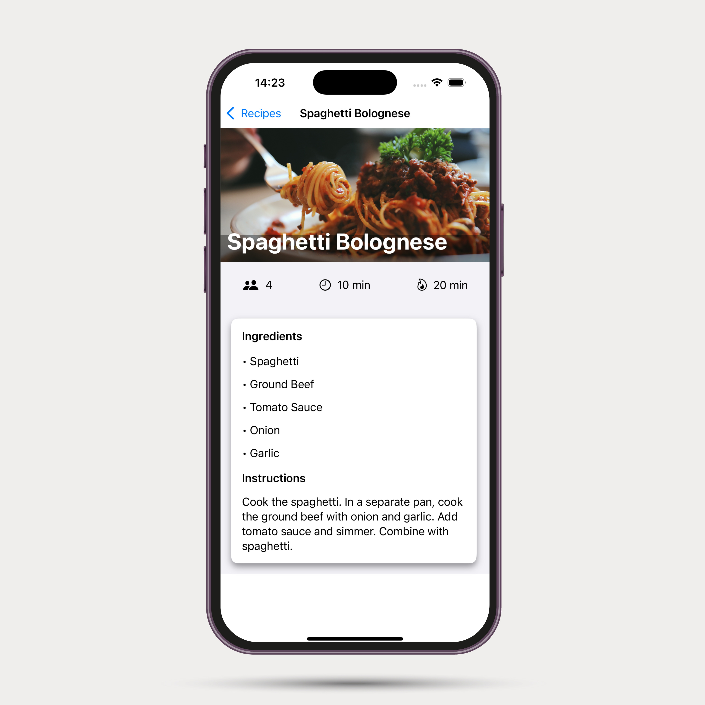
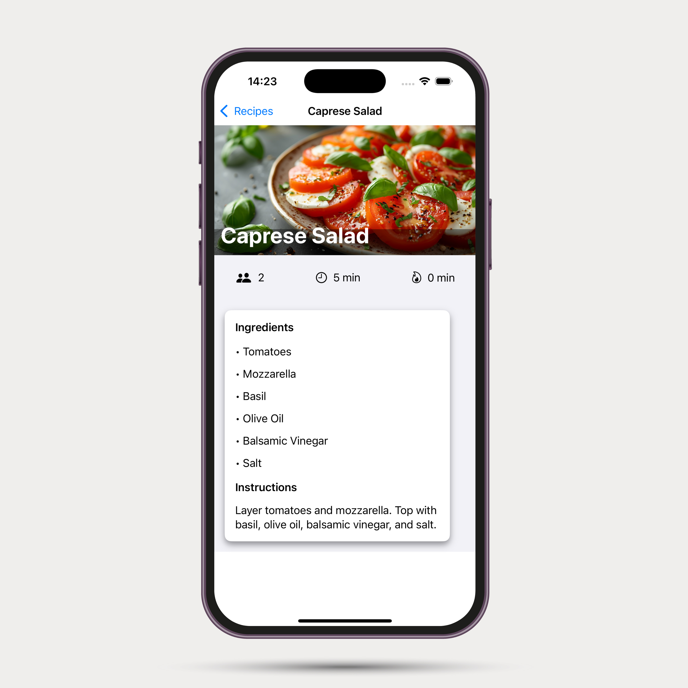

# 🍽 SimpleRecipeApp

**SimpleRecipeApp**, SwiftUI ile geliştirilmiş basit ve şık bir tarif uygulamasıdır. Kullanıcılar favori tarifleri listeleyebilir ve detay sayfasından malzemeleri ile pişirme talimatlarını inceleyebilir.

---

## 📱 Ekran Görüntüleri

### Ana Liste


### Tarif Detayı - Spaghetti Bolognese


### Tarif Detayı - Caprese Salad


---

## ✨ Özellikler

- 10+ popüler yemek tarifi
- Detay sayfasında:
  - Kişi sayısı
  - Hazırlık ve pişirme süresi
  - Malzeme listesi
  - Pişirme talimatları
- Modern SwiftUI arayüzü

---

## 🚀 Kurulum

Projeyi klonlayın:

```bash
git clone https://github.com/erncanyildirim/SimpleRecipeApp.git
cd SimpleRecipeApp
open SimpleRecipeApp.xcodeproj
